# Project Screenshots

---

Below are the screenshots (ordered by filename). Click any image to view it full-size.

1. 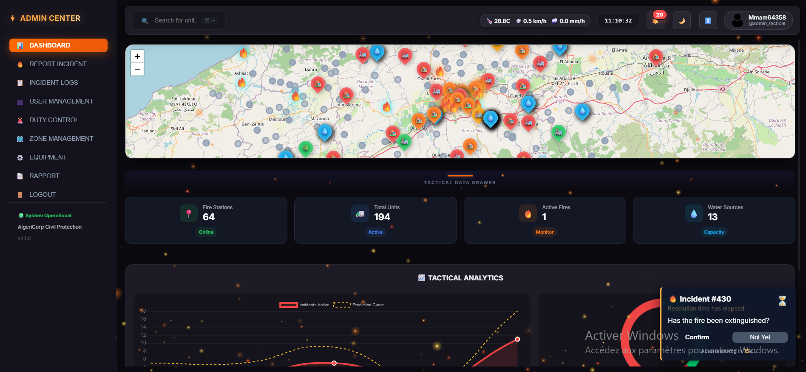

   Brief: Dashboard / main map view showing active incidents and units.

2. 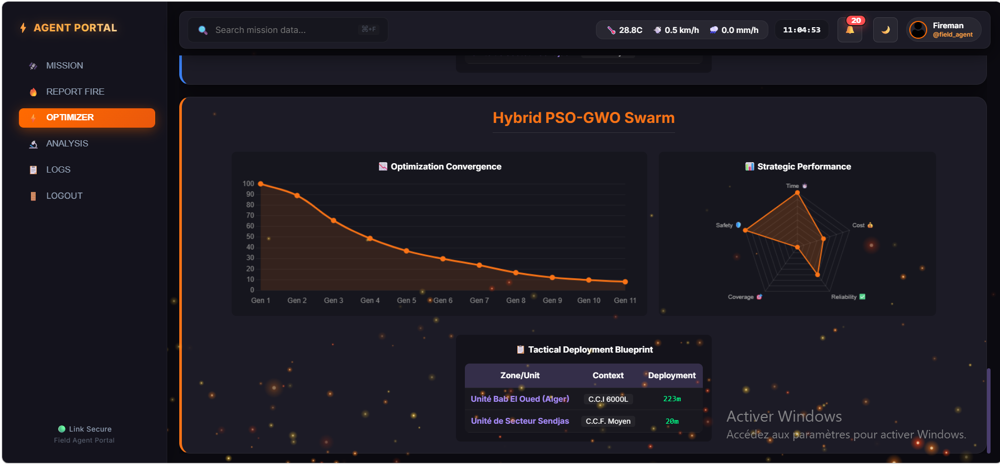

   Brief: Incident detail panel with escalation scoring.

3. 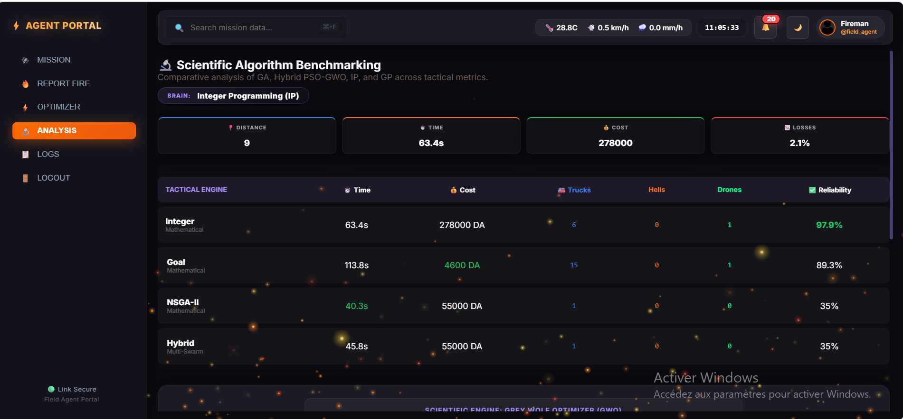

   Brief: Dispatch planning modal showing selected units.

4. 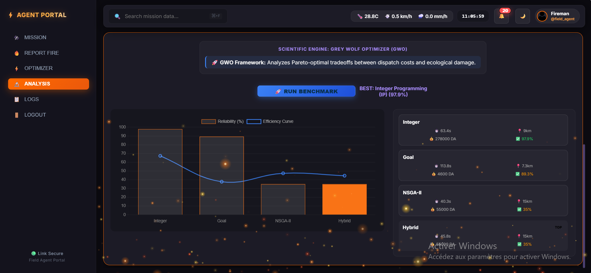

   Brief: Fireman tactical view with ETA and equipment status.

5. 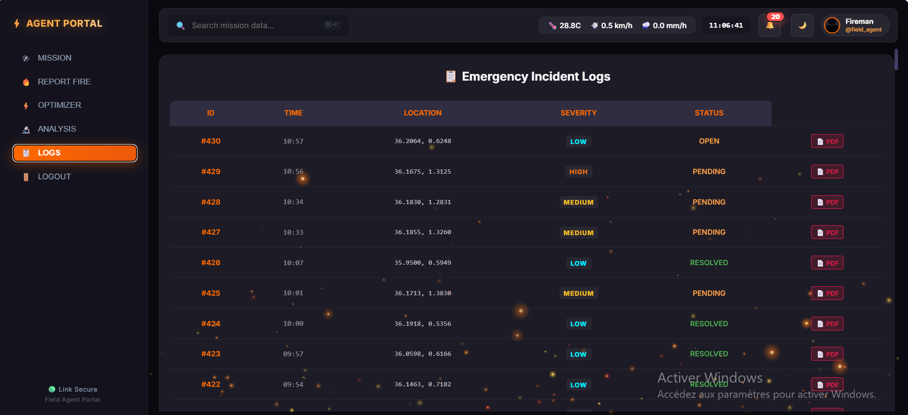

   Brief: Admin analytics / algorithm benchmarking chart.

6. 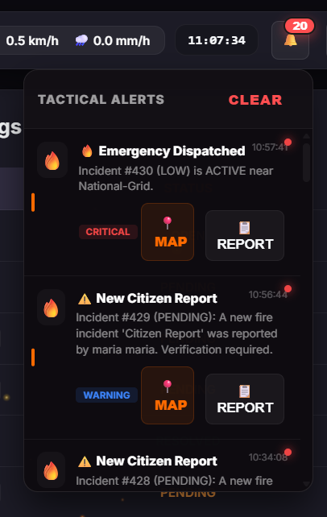

   Brief: Unit management UI (add / edit units and resources).

7. 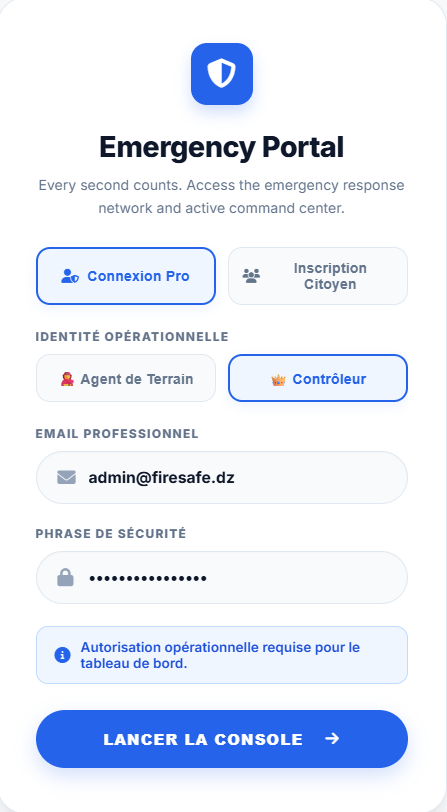

   Brief: Citizen SOS submission form (map pin and details).

8. 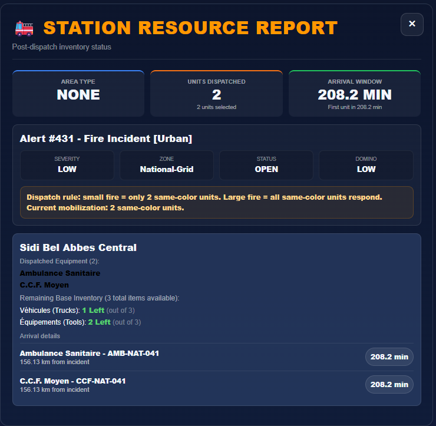

   Brief: Escalation history and incident timeline.

9. 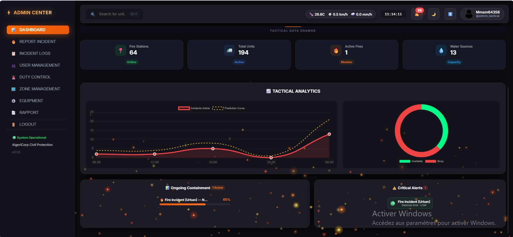

   Brief: Map layer selector and zone highlighting.

10. 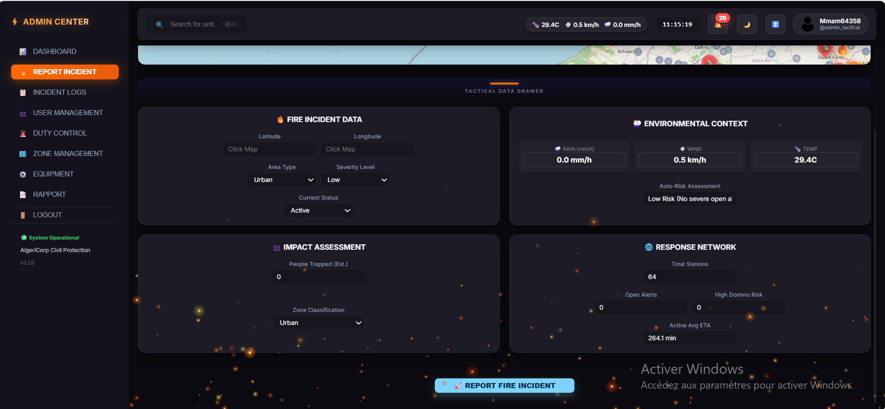

    Brief: Notifications panel with recent alerts.

11. 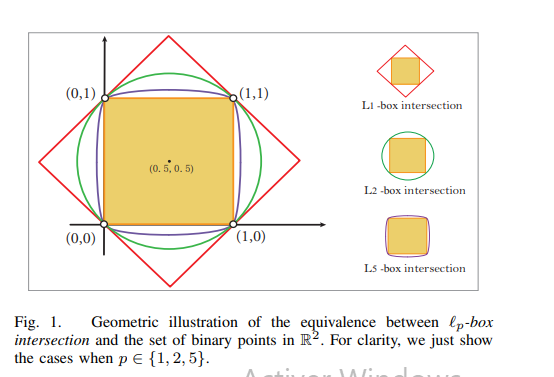

    Brief: Algorithm parameters modal (GWO / NSGA-II settings).

12. 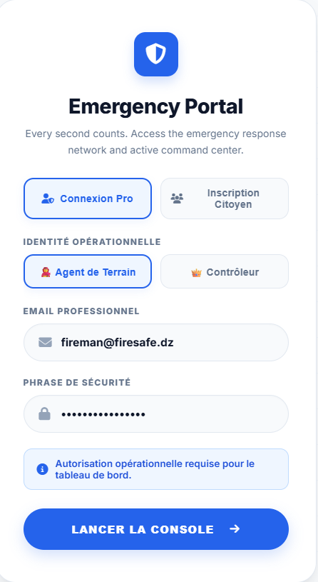

    Brief: Weather telemetry overlay on map.

13. 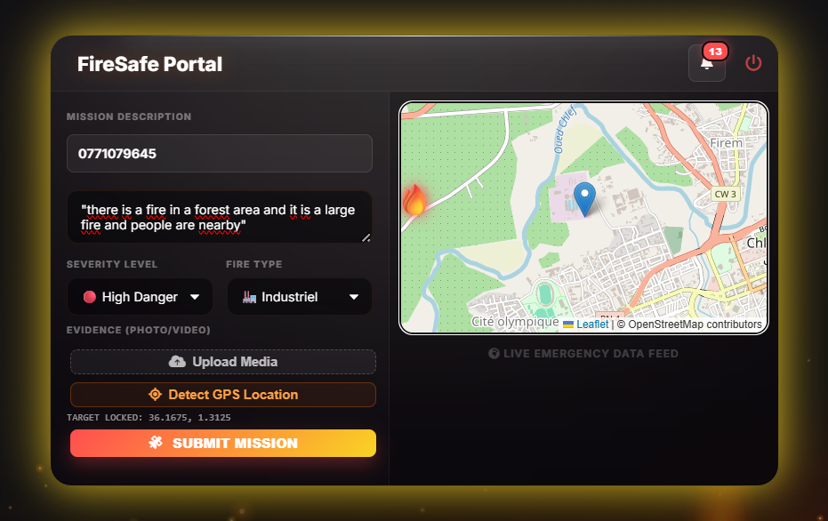

    Brief: Station resource report view.

14. 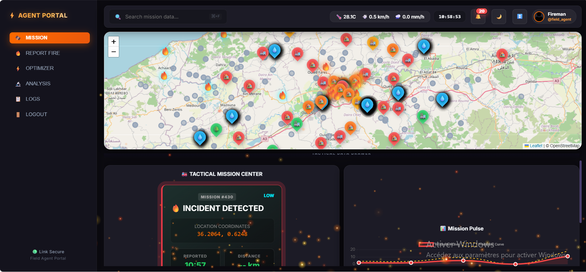

    Brief: Unit response / ETA timeline for an incident.

15. 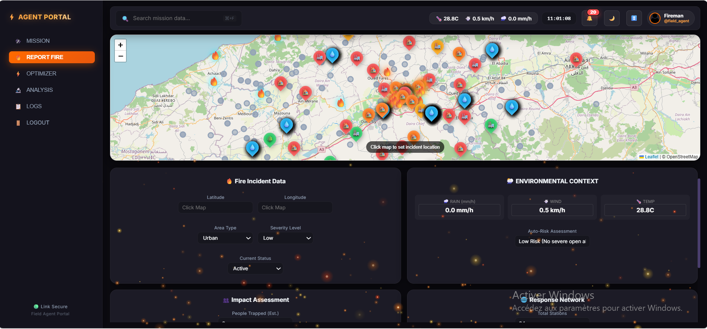

    Brief: Preview dispatch modal before commit.

16. 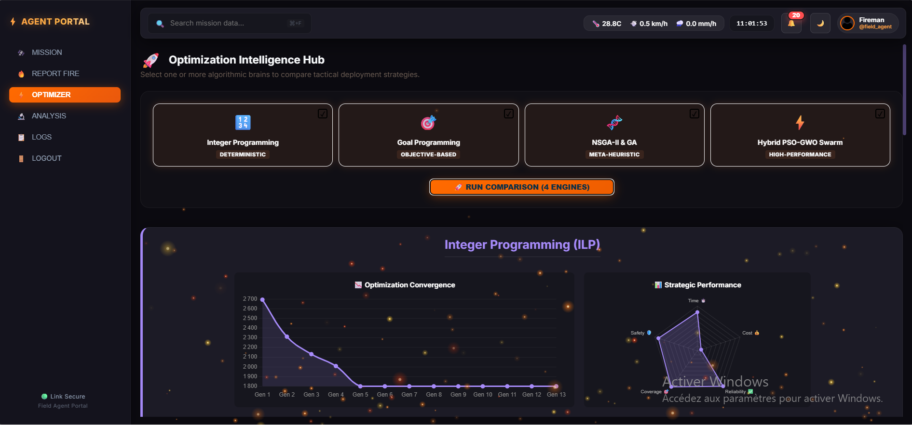

    Brief: Login screen (Google OAuth / local accounts).

17. 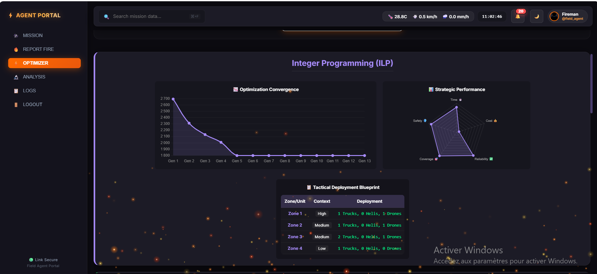

    Brief: Sample alert detail with domino-risk indicators.

18. 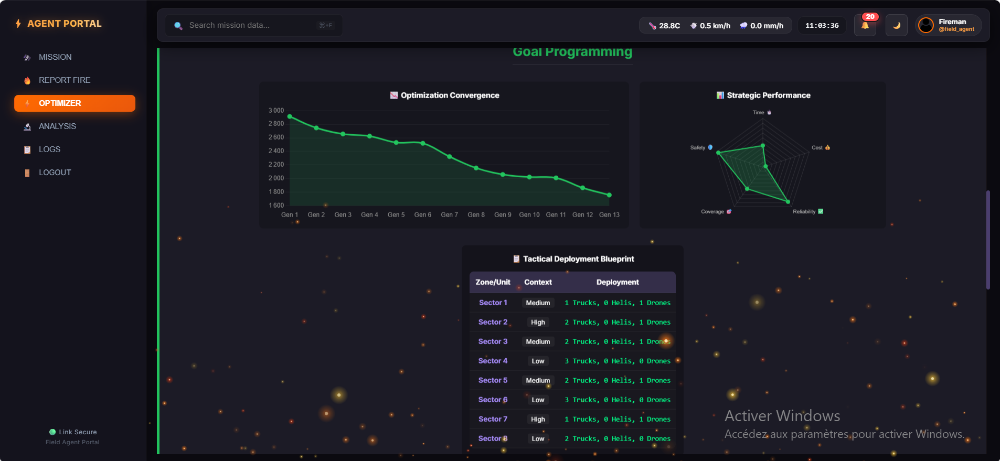

    Brief: Reporting and export options (PDF / CSV).

19. 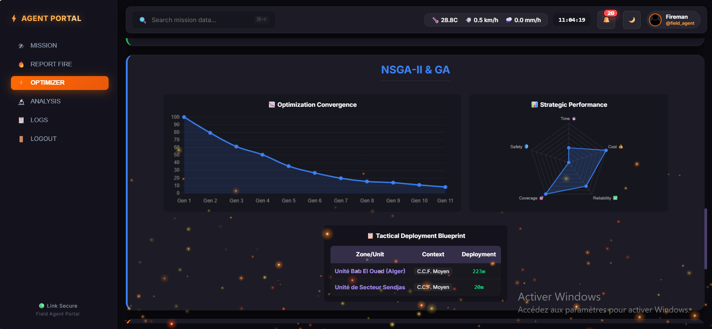

    Brief: Miscellaneous UI / small-screen layout preview.

---

If you'd like different descriptions, or a different ordering, tell me how you'd prefer them and I'll update this file.
